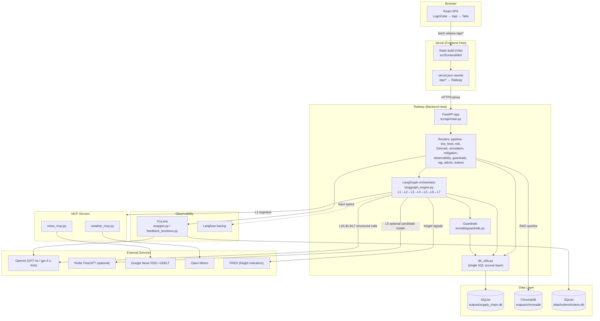
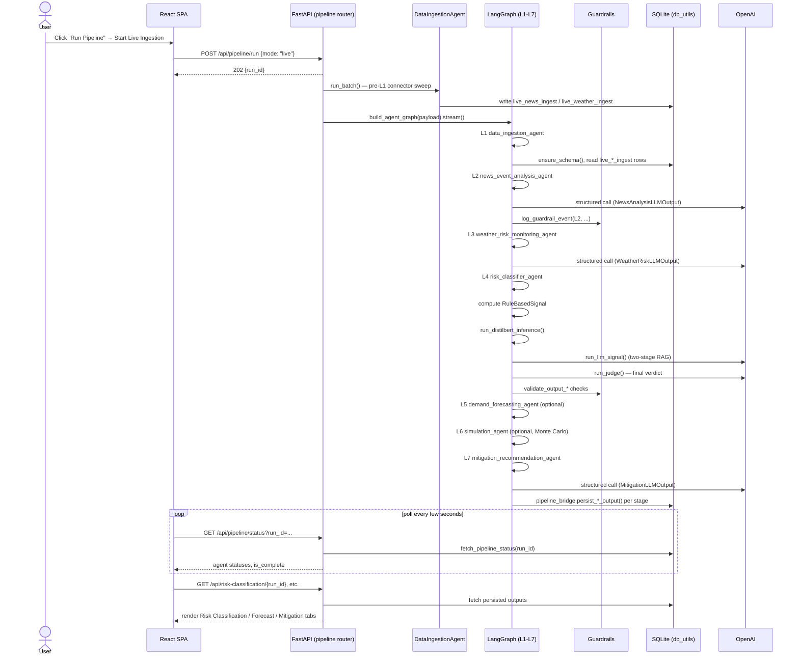
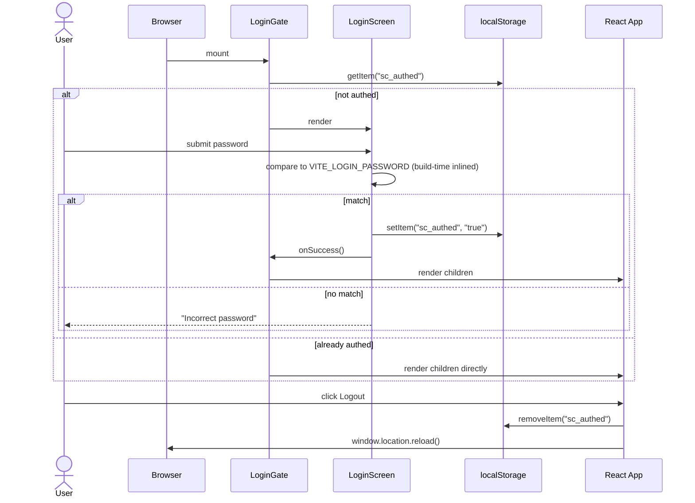

# UML Diagrams — Supply Chain Disruption Predictor

Complements `docs/ARCHITECTURE.md` (prose + ASCII pipeline description) with
formal UML-style diagrams in [Mermaid](https://mermaid.js.org/) syntax, which
renders natively on GitHub. Three diagrams: class, component, sequence.

Scope note on the class diagram: most of the L1–L7 pipeline is written as
plain functions operating on `GlobalState` (verified directly against
`src/agents/*/agent.py` — `news_event_analysis_agent`,
`weather_risk_monitoring_agent`, `risk_classifier_agent`, `simulation_agent`,
`mitigation_recommendation_agent` are all functions, not methods), not an
object hierarchy. The class diagram below therefore focuses on the two real
classes in the pipeline (`DataIngestionAgent`, `DemandForecastingAgent`) plus
the Pydantic domain models that actually carry state between stages, since
those are what a class diagram can meaningfully represent here.

---

## 1. Class Diagram

Domain models from `src/agents/state.py`, the two OOP agent classes, and the
supporting model classes from `src/utils/guardrails.py` and the TruLens
integration layer.

```mermaid
classDiagram
    class GlobalState {
        +str run_id
        +EventMetadata event_metadata
        +List~NewsRiskSignal~ news_signals
        +ForecastHandoff forecast_handoff
        +RiskClassificationResult risk_classification
        +ForecastResult forecast_result
        +SimulationResult simulation_result
        +MitigationAction mitigation_action
        +List~str~ agent_logs
        +risk_label : str
        +risk_score_composite : float
    }

    class EventMetadata {
        +str disruption_type
        +str affected_port
        +str affected_route
        +float severity
        +int shock_duration_days
        +int recovery_window_days
        +int simulation_trials
    }

    class NewsRiskSignal {
        +str category
        +float severity
        +str summary
        +List~str~ signal_tags
        +float expected_duration_days
    }

    class RuleBasedSignal {
        +float composite_score
        +str base_label
        +str escalated_label
        +bool escalated
        +float duration_days
    }

    class DistilBERTSignal {
        +str predicted_label
        +float confidence
        +Dict probability_distribution
        +float inference_ms
    }

    class LLMSignal {
        +str predicted_label
        +str rationale
        +List~str~ rag_citations
        +str confidence_level
        +str primary_driver
    }

    class JudgeVerdict {
        +str final_label
        +str verdict_type
        +bool signals_agreed
        +bool final_critical_flag
    }

    class RiskClassificationResult {
        +float composite_score
        +str base_label
        +str final_label
        +bool escalated
        +bool critical_flag
        +RuleBasedSignal rule_signal
        +DistilBERTSignal distilbert_signal
        +LLMSignal llm_signal
        +JudgeVerdict judge_verdict
    }

    class ForecastHandoff {
        +str sku_id
        +float risk_score_composite
        +str risk_label
        +float duration_days
    }

    class ForecastResult {
        +float expected_drop_pct
        +str model_selected
        +str sku_id
        +float stockout_prob
        +float mape_prophet_selected
    }

    class SimulationResult {
        +float stockout_probability_pct
        +float days_to_stockout_p50
        +float revenue_impact_usd_p50
        +int trials_run
        +str model_version
    }

    class MitigationAction {
        +str summary
        +List~str~ recommendations
        +str cost_delta
        +str urgency
        +List~str~ rag_citations
    }

    class DataIngestionAgent {
        -str xlsx_path
        +run_batch() IngestionRunResult
    }

    class IngestionRunResult {
        +int rows_written
        +List~str~ sources_polled
    }

    class DemandForecastingAgent {
        -str xlsx_path
        +list_skus() list
        +select_best_model(weekly) dict
        +run(sku_id) _DFAResult
        +run_all()
    }

    class InsufficientHistoryError

    class GuardrailResult {
        +bool passed
        +str reason
        +str guardrail_name
    }

    class LLMCallRecord {
        +str run_id
        +str agent_name
        +str model
        +float latency_ms
        +int input_tokens
        +int output_tokens
        +float cost_usd
        +str status
    }

    class PipelineRunner {
        +GlobalState final_state
        +Dict node_latencies_ms
        +List~LLMCallRecord~ llm_calls
        +run(payload, run_id) str
    }

    GlobalState "1" *-- "0..1" EventMetadata
    GlobalState "1" *-- "0..*" NewsRiskSignal
    GlobalState "1" *-- "0..1" ForecastHandoff
    GlobalState "1" *-- "0..1" RiskClassificationResult
    GlobalState "1" *-- "0..1" ForecastResult
    GlobalState "1" *-- "0..1" SimulationResult
    GlobalState "1" *-- "0..1" MitigationAction
    RiskClassificationResult "1" *-- "0..1" RuleBasedSignal
    RiskClassificationResult "1" *-- "0..1" DistilBERTSignal
    RiskClassificationResult "1" *-- "0..1" LLMSignal
    RiskClassificationResult "1" *-- "0..1" JudgeVerdict
    DataIngestionAgent ..> IngestionRunResult : produces
    DemandForecastingAgent ..> ForecastResult : produces
    DemandForecastingAgent ..> InsufficientHistoryError : raises
    PipelineRunner "1" *-- "0..*" LLMCallRecord
    PipelineRunner ..> GlobalState : wraps run_pipeline()
    LLMCallRecord ..> GuardrailResult : checked against
```

---

## 2. Component Diagram

Mermaid has no dedicated UML component-diagram notation, so this uses a
`flowchart` with subgraphs as component boundaries — the standard convention
for representing component diagrams in Mermaid/Markdown.

---

## 3. Sequence Diagrams

### 3.1 "Run Pipeline" — live mode, end to end

Covers `POST /api/pipeline/run` (`mode: "live"`) through the full L1–L7
chain, matching `src/api/routers/pipeline.py` and `langgraph_engine.py`.

### 3.2 Login gate (frontend-only)

